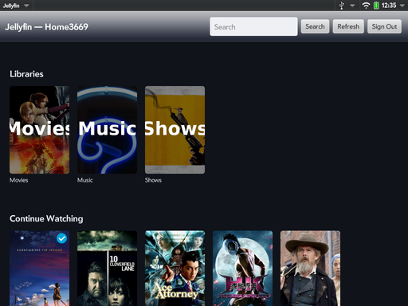
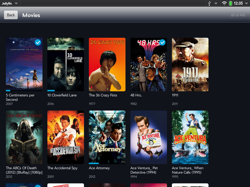
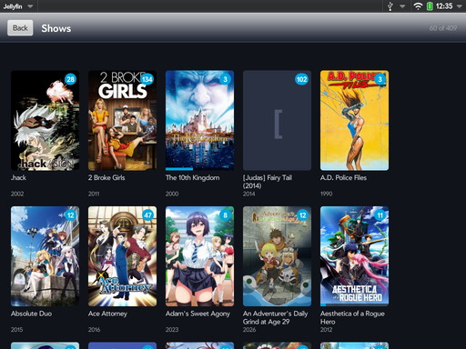
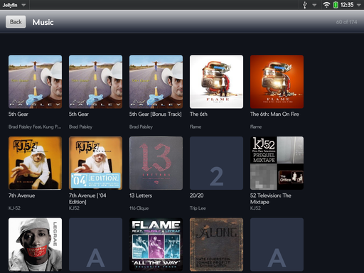
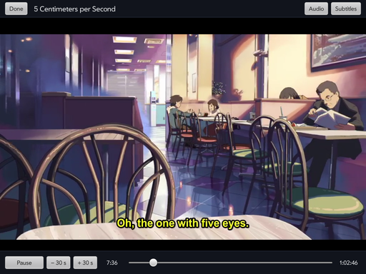
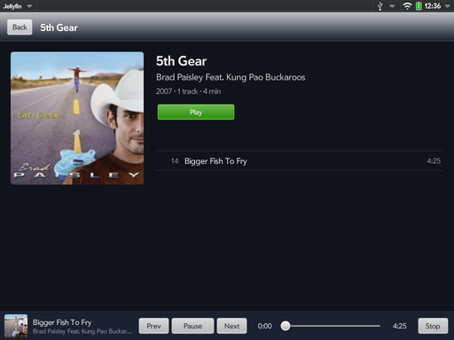
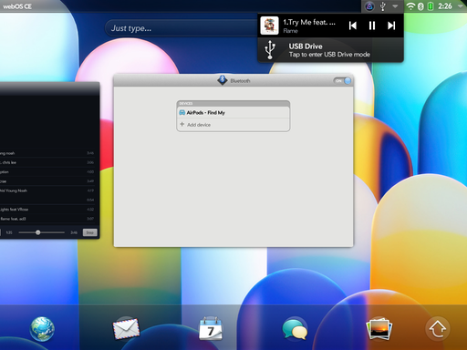
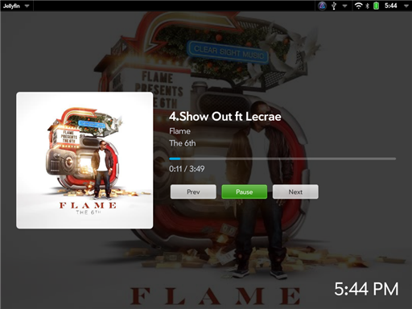
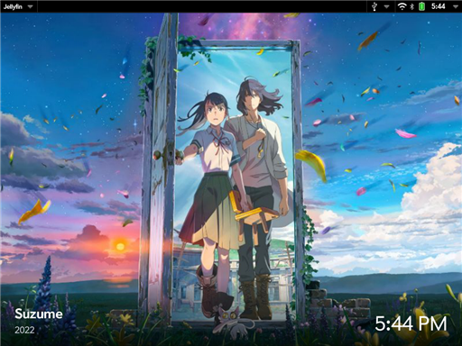

# Jellyfin for webOS

A Jellyfin client for the HP TouchPad, written in Enyo 1 (the TouchPad's own framework).

## Features

- Sign in to any Jellyfin server, over `http` or `https`; servers on your network are listed
- Uses the server's home address when you are home and its `https` address when you are out
- Home screen with Continue Watching, Next Up, Latest and your libraries
- Browse movies, shows (series → seasons → episodes) and music (albums)
- Movies and shows by Unwatched, Favorites, Collections, Genres or Studios, sorted by name, date
  added, release date, rating, running time or last watched; add favorites from any movie, episode
  or show
- Search across movies, shows, episodes, albums and tracks, also from Just Type (turn Jellyfin on
  under Just Type's Search Using preferences)
- Full-screen video player with seeking, ±30 s, audio track and subtitle choice
- Resume where you left off, and play the next episode automatically
- Download movies, episodes or whole seasons to watch offline, choosing audio, subtitles and quality;
  download albums, playlists and tracks to listen offline. The app warns before a download that may
  not fit, and what you watch offline reaches the server once it can be reached again
- Music player that keeps playing while you browse, with a Now Playing bar, controls in the
  notification area, and Bluetooth and headset buttons
- Music by album, artist, genre or playlist; shuffle and repeat; a Now Playing screen with an
  queue you can reorder; Play Next, Add to Queue, playlists, favorites, Instant Mix, and Recently and
  Most Played lists
- Exhibition mode on a Touchstone dock: what is playing, with its controls, or a slideshow of
  your movie and show artwork with a clock (pick Jellyfin in Exhibition's menu)
- Playback progress, watched status and play counts reported to the server
- Experimental phone layout (Pre3 and other webOS phones): smaller posters, stacked pages, a
  slimmer header and music bar, and Refresh and Sign Out in the app menu

## Screenshots

Tap a picture for the full 1024×768 screenshot.

| | |
|---|---|
| [](screenshots/home.png) | [](screenshots/movies.png) |
| Home | Movies |
| [](screenshots/shows.png) | [](screenshots/music.png) |
| Shows | Music |
| [](screenshots/video-controls.png) | [](screenshots/video.png) |
| Video, controls showing | Video, full screen with subtitles |
| [](screenshots/album.png) | [](screenshots/notification-controls.png) |
| Album, with the Now Playing bar | Music controls in the notification area, with Bluetooth AirPods |
| [](screenshots/exhibition-music.png) | [](screenshots/exhibition-slideshow.png) |
| Exhibition on the dock, music playing | Exhibition on the dock, library artwork |

## Requirements

- HP TouchPad running **webOS Community Edition 3.1.0** (recommended), or webOS 3.0.5.
  Stock 3.0.5 cannot reach modern HTTPS servers at all; CE can.
- Jellyfin server 10.9 or later (developed against 12.1)

## How playback works

The TouchPad's hardware decoder handles H.264 Baseline up to about 1024×576, and its media
player is from 2011. The app asks the server how to play each item, the way official clients do:
it sends a device profile to `/Items/{id}/PlaybackInfo`, and the server answers with either the
file itself (when the TouchPad can play it) or a stream it converts on the fly.

A few things the TouchPad needs, found the hard way:

- **One continuous MPEG-TS stream, not HLS.** The TouchPad's HLS reader stalls after a jump and
  loses the picture or the sound. Seeking in a converted stream asks the server for a new stream
  that starts at the new time.
- **The video fills the screen and is never resized**, with the controls floating over it. This
  follows HP's own video players; a video in a resizable box stops updating its picture.
- **Subtitles are drawn into the picture by the server.** Text laid over the video makes it stutter.
- **A small relay service for `https` servers.** The media player's network code (libsoup on
  GnuTLS 2) cannot connect to a modern HTTPS server, even on webOS CE. For an `https` address the
  app hands the stream to its bundled service (`service/relay.js`), which fetches it with CE's
  modern `curl` and passes it to the player at a local `http://127.0.0.1` address. Only addresses
  the app registers are relayed. Plain `http` addresses go straight to the player.

## Finding the server at home

The sign-in screen lists Jellyfin servers on your network, and if you signed in with an
`https` address, the app learns the same server's home address and switches to it
whenever it answers. Both rely on Jellyfin's discovery, which is on by default
(Dashboard → Networking → Enable Auto Discovery). webOS's firewall drops replies to a
broadcast, so the bundled service also asks each address on the local network directly.

## Layout

```
app/          the Enyo 1 web app (appinfo.json, index.html, source/, stylesheets/)
service/      the stream relay, a Node.js 0.4 webOS service
package/      packageinfo.json, which bundles the app and service into one .ipk
art/          icon.svg, the source of the app icons
screenshots/  README pictures (*-small.png) and the full-size originals
tools/        deploy.ps1 (package, install, launch) and tp-tools.ps1 (device helpers)
```

## Building

With the Palm SDK installed and a TouchPad connected over USB:

```
palm-package app service package
palm-install com.stark.jellyfin_<version>_all.ipk
```

On Windows, `tools\deploy.ps1` does all three steps and relaunches the app (edit the SDK and Java
paths at the top first).

## Known issues

- After a seek or track change, a converted stream takes a few seconds to start (downloads seek instantly).
- The phone layout is experimental: checked at Pre3 size in a desktop preview, not yet on a phone.
  A tester reports that video fails on a Pre3 (error 2); music works.
- The wired headset button and unplug-to-pause are untested; the notification-area and
  Bluetooth controls are tested.
- No Live TV yet.

## License

GPL-3.0. See [LICENSE](LICENSE).

The app icon (`art/icon.svg` and `app/images/icon*.png`, `miniicon.png`) is built on the Jellyfin
logo from [jellyfin/jellyfin-ux](https://github.com/jellyfin/jellyfin-ux), © the Jellyfin contributors,
used under [CC BY-SA 4.0](https://creativecommons.org/licenses/by-sa/4.0/). The icon is shared under
the same license. This app is not made by or affiliated with the Jellyfin project.
